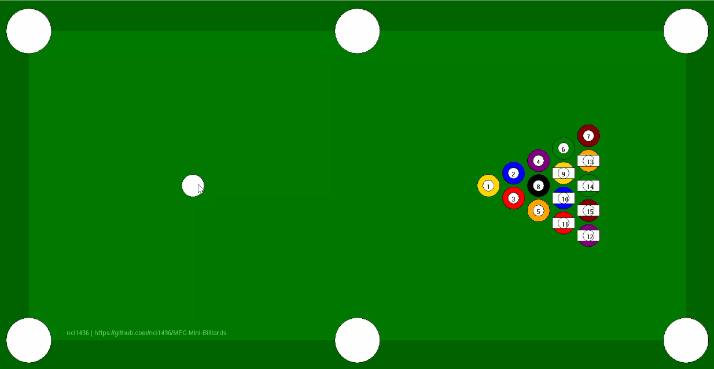
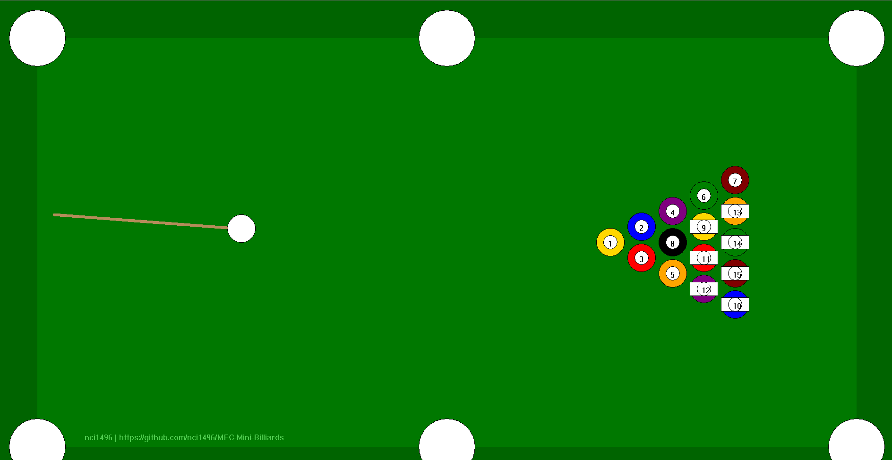
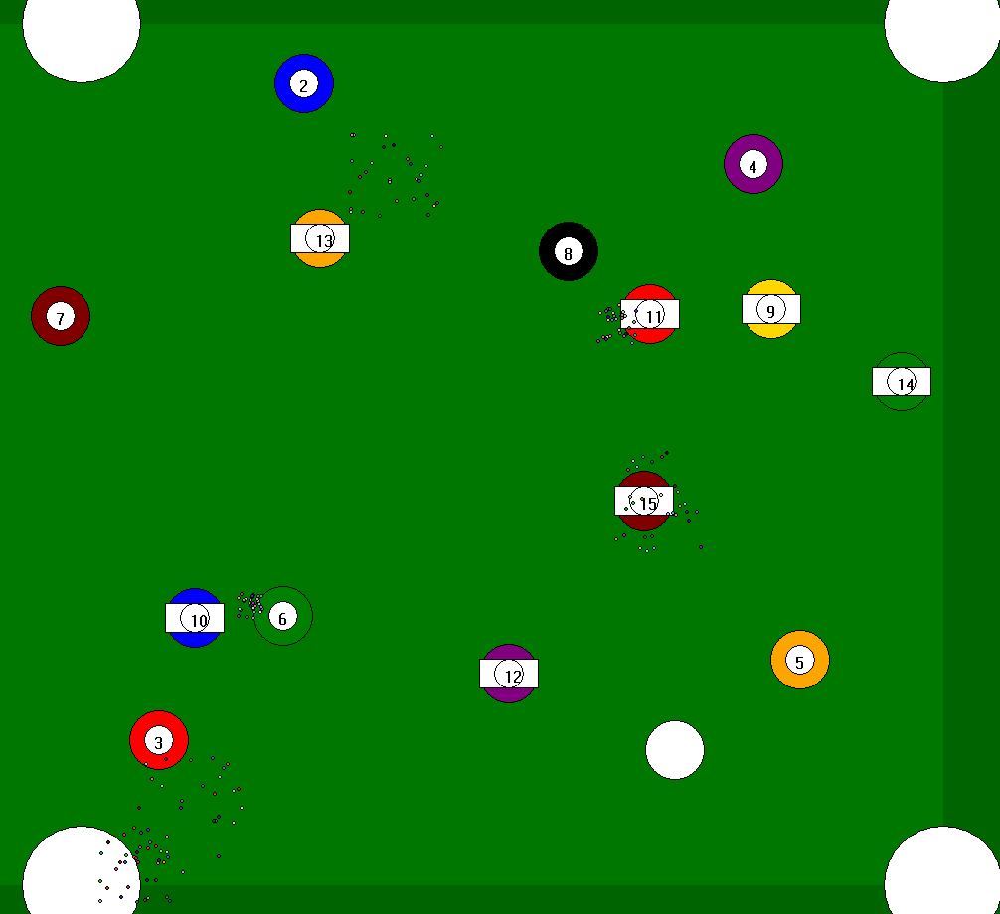

# 🎱 MFC Mini Billiards

A lightweight mini billiards game developed using MFC (Microsoft Foundation Classes).  
This project demonstrates basic physics simulation and interactive gameplay in a classic Windows desktop environment.

---

## 🖼️ Preview

---

## ✨ Features

- 🎯 Real-time ball collision and reflection
- 🖱️ Mouse-based aiming and shooting
- 💥 Particle effects for visual feedback
- 🔄 Simple game reset system
- 🪶 Lightweight (single executable, no installation required)

---

## 🎮 Controls

- Move the mouse to aim
- Release the left mouse button to shoot

---

## 🚀 How to Run

1. Download the latest version from the **Releases** page    
2. Double-click the `.exe` file to start the game  

> No installation required.

---

## 🧠 Technical Highlights

- Custom 2D physics simulation (collision detection & response)
- Continuous motion update with friction
- Basic particle system for impact effects
- Double buffering rendering to reduce flickering

---

## 📦 Release

👉 Download here:  
[Releases](../../releases)

---

## 👤 Author

**nci1496** 
GitHub: [nci1496 · GitHub](https://github.com/nci1496/)

---

## 📌 Notes

This project was created as a small demo for showcasing interactive graphics and basic game mechanics using MFC.

---

## 📝 License

This project is for educational and demonstration purposes.
